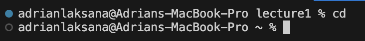

**Lab Report 1**

# `cd` Command

## `cd` no arguments

When provided no arguments, the command changes the directory to the parent directory of the local device. In my case, my absolute path was /Users/adrianlaksana/Coding/lecture1  and was brought back to the root directory of my device when running the command. This command outputs no error.

## `cd` with path to directory
//put image here

When providing a directory, it changes the working directory to the specified argument provided. In the example, the `pwd` was the root folder, and the child directory that was being `cd` to was "Coding". This output is not an error. However, this command only works if the argument is a child directory to the current working directory. If the current working directory is a child directory and the argument is a parent directory, it outputs an error. 

## `cd` with path to file
//put image here

With the absolute path being /Users/adrianlaksana/Coding/lecture1, it outputs an error when a file is provided. This is because files such as Hello.java are not working directories but rather files with content.

# `ls` Command

## `ls` no arguments
//put image here

While the absolute path was /Users/adrianlaksana/Coding/lecture1, when running `ls` without any arguments, the output was a singular line that lists out the current directories under the `pwd` lecture1. This did not output and error.

## `ls` with path to directory
//put image here

While the absolute path was /Users/adrianlaksana/Coding/lecture1, when running `ls` to directory of "messages" it lists out the text files contained inside the messages directory in a single line. This did not output an error.

## `ls` with path to file
//put image here

While the absolute path was /Users/adrianlaksana/Coding/lecture1, when running `ls` to file name Hello.java, it a line that prints "Hello.java". This is because it lists the contents of Hello.java which is just itself. This does not output and error.

# `cat` Command

## `cat` no arguments
//put image here

While the absolute path was /Users/adrianlaksana/Coding/lecture1, when running `cat` with no arguments, the terminal goes to the next line, but no text is outputted. This is because no file was given as an argument to output its content. After additional individual testing, anything typed and entered following is repeated in another line as an output. No error is found.

## `cat` with path to directory
//put image here

With the same absoulate path, when running  `cat` with the argument to the folder "messages" it outputs an error. This is because `cat` reads and writes data, but a directory folder organizes files with content, not store the content that is read. 

## `cat` with path to file
//put image here

While in the same absolute path, when running `cat` with "Hello.java" as an argument, it outputs the code contained in the file to the terminal. This is because `cat` reads the content and then outputs it to the user in the terminal. No error was found.

