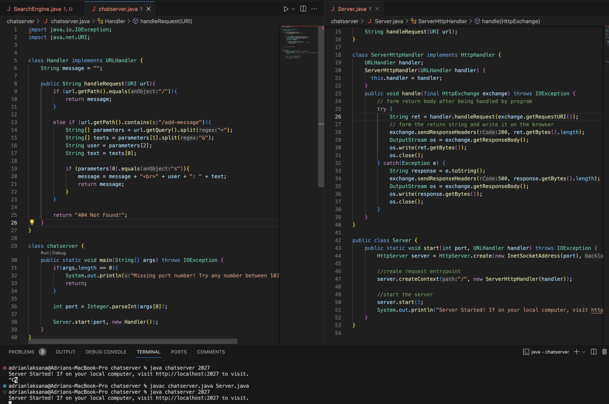
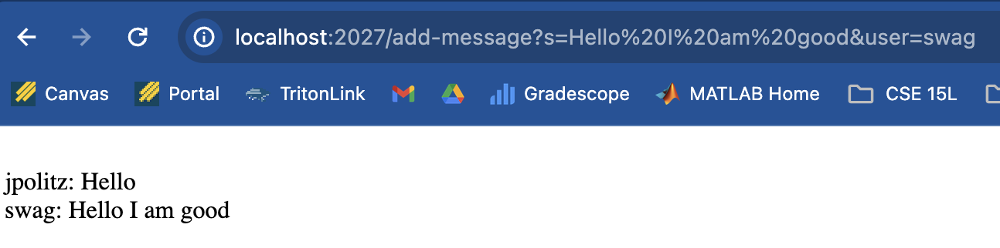
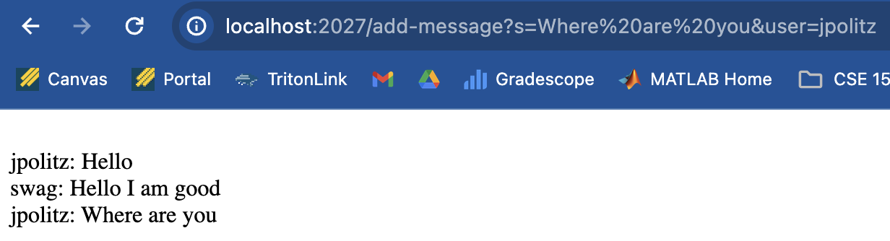

# **Lab Report 2**
***
# Part 1: Creating a Chat Server

## Using `/add=message`  
### Example 1

**Which Methods in your code are called?**  

First, the `main` method is called and checks for a properly started server with the correct amount of arguments.  
Then the `start` method is called. Then `parseInt` is called and which is used to chain and call the `handleRequest` method. Within this method, the methods `getPath`, `equals`, `contains`, `getQuery`, and `split` are called.  
  
**What are the relevant arguments to those methods, and the values of any relevant fields of the class?**  

**Methods**  
`main`: Takes the terminal arguments inputted by the user.  
`start`: Has two arguments, with the first being `port` and the second being a new object of the `Handler` class.  
`handleRequest`: Takes a `url` object of type `URI`.  
`getPath`: takes no arguments  
`.contains`: In this case, the argument in this instance of calling the method is `.contains("add-message")`.  
`getQuery`: takes no arguments  
`split`: In this case, the argument in this instance of calling the method is `.split("=")` and `.split.("&")`.  
`equals`: In this case, the argument in this instance of calling the method is `.equals("s")`.  

**Fields**  
  - `url = localhost:2027/add-message?s=Hello%201%20am%20good&user=swag`
  - `int port = args[0]` where `args[0]=2027`  
  - `String[] parameters = {"s", "Hello%201%20am%20good&user", "swag"`  
  - `String[] texts = {"Hello%201%20am%20good", "user"}`  
  - `String user = "swag:`  
  - `String text = "Hello%201%20am%20good"`  
  - `message = "jpolitz: Hello   swag: Hello I am good`  

**How do the values of any relevant fields of the class change from this specific request? If no values got changed, explain why.**  

For this specific request, the fields that are changed are `url`, `parameters[1]`, `parameters[2]`, `texts`, `user`, `text`, and `message`. This is changed depending on the inputted url by the user. In this case, all the respective fields are changed in order to add the inputted message and username from the input. The `port` field remains the same because it is running on the same server that was initially started.

### Example 2

**Which Methods in your code are called?**  
In this case, the same methods are called as the first example.

**What are the relevant arguments to those methods, and the values of any relevant fields of the class?**  

The methods called have the same arguments from the previous. However, the respective fields have been changed to this specific `url` request.

**Fields**  
  - `url = localhost:2027/add-message?s=Where%20are%20you&user=jpolitz`  
  - `int port = args[0]` where `args[0]=2027`  
  - `String[] parameters = {"s", "Where%20are%20you&user", "jpolitz"`  
  - `String[] texts = {"Where%20are%20you", "user"}`  
  - `String user = "jpolitz:`  
  - `String text = "Where%20are%20you"`  
  - `message = "jpolitz: Hello   swag: Hello I am good <be> jpolitz: Where are you`  

**How do the values of any relevant fields of the class change from this specific request? If no values got changed, explain why.**  

Similar to the first example, the fields of this class change with the changes apparent in the `URL` inputted by the user. To achieve the relevant values for the fields, `.split` is the primary method for creating array objects that can be indexed.
