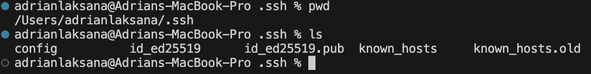
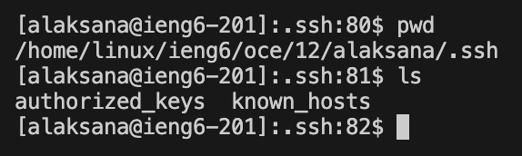

# **Lab Report 2**
***
# Part 1: Creating a Chat Server

## Using `/add=message`  
### Example 1

**Which Methods in your code are called?**  

In order to run the server, first, the `main` method is called and checks for a properly started server with the correct amount of arguments.  
Then the `parseInt` method is called. Then `start` is called and uses `port` and the `handleRequest` method. Within this method, the methods `getPath`, `equals`, `contains`, `getQuery`, and `split` are called.  
  
**What are the relevant arguments to those methods, and the values of any relevant fields of the class?**  

**Methods**  
`main`: Takes the terminal arguments inputted by the user.  
`start`: Has two arguments, with the first being `port` and the second being a new object of the `Handler` class.  
`parseInt`: Takes `args[0]` and parses it to an Integer to become the `port`.
`handleRequest`: Takes a `url` object of type `URI`.  
`getPath`: takes no arguments  
`.contains`: In this case, the argument in this instance of calling the method is `.contains("add-message")`.  
`getQuery`: takes no arguments  
`split`: In this case, the argument in this instance of calling the method is `.split("=")` and `.split.("&")`.  
`equals`: In this case, the argument in this instance of calling the method is `.equals("s")`.  

**Fields**  
  - `url = localhost:2027/add-message?s=Hello%201%20am%20good&user=swag`
  - `int port = args[0]` where `args[0]=2027`  
  - `String[] parameters = {"s", "Hello%201%20am%20good&user", "swag"`  
  - `String[] texts = {"Hello%201%20am%20good", "user"}`  
  - `String user = "swag:`  
  - `String text = "Hello%201%20am%20good"`  
  - `message = "jpolitz: Hello   swag: Hello I am good`  

**How do the values of any relevant fields of the class change from this specific request? If no values got changed, explain why.**  

For this specific request, the fields that are changed are `url`, `parameters[1]`, `parameters[2]`, `texts`, `user`, `text`, and `message`. This is changed depending on the inputted url by the user. In this case, all the respective fields are changed to add the inputted message and username from the input. The `port` field remains the same because it runs on the same server initially started.

### Example 2

**Which Methods in your code are called?**  
In this case, the same methods are called as the first example. However, since the server is already started, `main` no longer needs to be called and `start` the server. Therefore, the new url inputted by the user is handled by the `handleRequest` method.

**What are the relevant arguments to those methods, and the values of any relevant fields of the class?**  

The methods called have the same arguments from the previous. However, the respective fields have been changed to this specific `url` request.

**Fields**  
  - `url = localhost:2027/add-message?s=Where%20are%20you&user=jpolitz`  
  - `int port = args[0]` where `args[0]=2027`  
  - `String[] parameters = {"s", "Where%20are%20you&user", "jpolitz"`  
  - `String[] texts = {"Where%20are%20you", "user"}`  
  - `String user = "jpolitz:`  
  - `String text = "Where%20are%20you"`  
  - `message = "jpolitz: Hello   swag: Hello I am good <be> jpolitz: Where are you"`  

**How do the values of any relevant fields of the class change from this specific request? If no values got changed, explain why.**  

Similar to the first example, the fields of this class change with the changes apparent in the `URL` inputted by the user. In this case, the message and user are changed, which results in the respective fields changing because the arrays will have different values stored. To achieve the relevant values for the fields, `.split` is the primary method for creating array objects that can be indexed.  
***
# Part 2  
## 1 Private Key
  

## 2 Public Key
  

## 3 Logging into ieng6  
  
***
# Part 3
In weeks 2 and 3, I learned that it is possible to access another computer remotely through the terminal. This idea interests me because I am curious about the possibilities a user can have with remote access. It makes it possible to access a faster or "stronger" computer that can handle more intensive tasks than one's local machine can.
