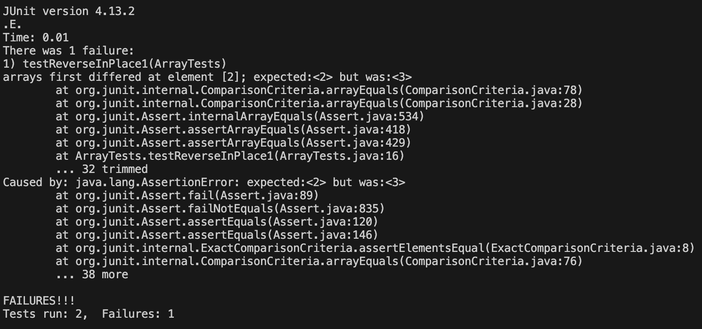

# **Lab Report 3**
***
## Part 1 - Bugs ArrayList ReverseInPlace
### 1. Fail-inducing Input
```
@Test
  public void testReverseInPlace1() {
    int[] input2 = {1, 2, 3, 4};
    ArrayExamples.reverseInPlace(input2);
    assertArrayEquals(new int[]{4,3,2,1}, input2);
  }
```

### 2. Non-Fail-Inducing Input
```
@Test  
public void testReverseInPlace() {  
    int[] input1 = { 3 };  
    ArrayExamples.reverseInPlace(input1);  
    assertArrayEquals(new int[]{ 3 }, input1);  
}
```  

### 3. The Symptom


### 4. Debugging
**Before**
```
static void reverseInPlace(int[] arr) {  
    for(int i = 0; i < arr. length; i += 1) {  
    arr[i] = arr[arr.length - i - 11];  
 }
```

**After**
```
static void reverseInPlace(int[] arr) {  
    for(int i = 0; i < arr.length / 2; i += 1) {  
      int temp = arr[i];  
      arr[i] = arr[arr.length - i - 1];  
      arr[arr.length - i - 1] = temp;  
    }  
  }
  ```

### 5. 
The method's description is intended to reverse and return the original inputted array. Therefore, to fix the bug, the for loop must be changed to `for (int i = 0; arr.length / 2; i += 1)` to prevent reversing after the index is past the halfway point. Then, a new temp array must be created so the back half of the array can be assigned to the front half of the array. 
***
## Part 2: Find Command

### find -type
source: https://math2001.github.io/article/bashs-find-command/  
ChatGPT Prompt: "how to use find -type"
"show an example for each -type"
```
adrianlaksana@Adrians-MacBook-Pro technical % find . -type d
.
./government
./government/About_LSC
./government/Env_Prot_Agen
./government/Alcohol_Problems
./government/Gen_Account_Office
./government/Post_Rate_Comm
./government/Media
./plos
./biomed
./911report
```
This example is finding directories within the technical directory. This is useful to see the relative paths for all the directories within a specified directory.

```
adrianlaksana@Adrians-MacBook-Pro technical % find ./911report -type f
./911report/chapter-13.4.txt
./911report/chapter-13.5.txt
./911report/chapter-13.1.txt
./911report/chapter-13.2.txt
./911report/chapter-13.3.txt
./911report/chapter-3.txt
./911report/chapter-2.txt
./911report/chapter-1.txt
./911report/chapter-5.txt
./911report/chapter-6.txt
./911report/chapter-7.txt
./911report/chapter-9.txt
./911report/chapter-8.txt
./911report/preface.txt
./911report/chapter-12.txt
./911report/chapter-10.txt
./911report/chapter-11.txt
```
This example uses the command to find all the regular files to the directory. This is useful because it would allow us to access and iterate all the files that aren't directories or subdirectories.

### find -name
source: https://math2001.github.io/article/bashs-find-command/  
ChatGPT Prompt: "how to use find -name"
```
adrianlaksana@Adrians-MacBook-Pro technical % find . -name "journal.pbio.0020001.txt"
./plos/journal.pbio.0020001.txt
```
This example shows using `-name` to find a specified file name. This is useful because the output will show the absolute path of a file which a user can use.

```
adrianlaksana@Adrians-MacBook-Pro technical % find ./government/Alcohol_Problems -name "*.txt"
./government/Alcohol_Problems/Session2-PDF.txt
./government/Alcohol_Problems/Session3-PDF.txt
./government/Alcohol_Problems/DraftRecom-PDF.txt
./government/Alcohol_Problems/Session4-PDF.txt
```
This example shows using `-name` to find all the files in the directory containing `*.txt`. This is useful because you can find all the files in a directory with a specified type or ending.

### find -path
source: https://math2001.github.io/article/bashs-find-command/  
ChatGPT Prompt: "find -path"
```
adrianlaksana@Adrians-MacBook-Pro technical % find . -path "*pro*"
./government/Gen_Account_Office/Paper_Walker11-2002_acpro122.txt
./government/Media/Nonprofit_Buys.txt
./government/Media/Barnes_pro_bono.txt
./government/Media/pro_bono_efforts.txt
```
This examples shows using `-path` to find all paths with the characters "pro" in it. This is useful because a user can find all files in a directory with a short amount of key characters rather than the entire file name or type.

```
adrianlaksana@Adrians-MacBook-Pro technical % find . -path "./government/Post_Rate_Comm/*"
./government/Post_Rate_Comm/Gleiman_EMASpeech.txt
./government/Post_Rate_Comm/Mitchell_spyros-first-class.txt
./government/Post_Rate_Comm/Cohenetal_CreamSkimming.txt
./government/Post_Rate_Comm/Cohenetal_DeliveryCost.txt
./government/Post_Rate_Comm/Mitchell_RMVancouver.txt
./government/Post_Rate_Comm/Gleiman_gca2000.txt
./government/Post_Rate_Comm/Cohenetal_Cost_Function.txt
./government/Post_Rate_Comm/Redacted_Study.txt
./government/Post_Rate_Comm/Mitchell_6-17-Mit.txt
./government/Post_Rate_Comm/Cohenetal_comparison.txt
./government/Post_Rate_Comm/Cohenetal_Scale.txt
./government/Post_Rate_Comm/Cohenetal_RuralDelivery.txt
./government/Post_Rate_Comm/ReportToCongress2002WEB.txt
./government/Post_Rate_Comm/WolakSpeech_usps.txt
```
This example shows using `-path` to output files in a specified directory. This is useful if a user wants to iterate through every file that is contained within a directory.

### find -not
source: https://math2001.github.io/article/bashs-find-command/  
ChatGPT Prompt: "find -not"
```
adrianlaksana@Adrians-MacBook-Pro technical % find ./911report -not -path "*chapter*"
./911report
./911report/preface.txt
```
This example shows how to use the `—not` command to output all the files without `chapter` in their path name. This is useful for obtaining all the files that do not meet a specified requirement.

```
adrianlaksana@Adrians-MacBook-Pro technical % find . -not -name "*.txt"

.
./government
./government/About_LSC
./government/Env_Prot_Agen
./government/Alcohol_Problems
./government/Gen_Account_Office
./government/Post_Rate_Comm
./government/Media
./plos
./biomed
./911report
```
This example shows the `-not` command being used to filter out all `.txt` files. In this case, technical is only directories and `.txt` files thus outputting only the directories. This is useful because a user can filter out specific file types from their search.

