# **Lab Report 4**
***
## Step 4: Logging into Ieng6
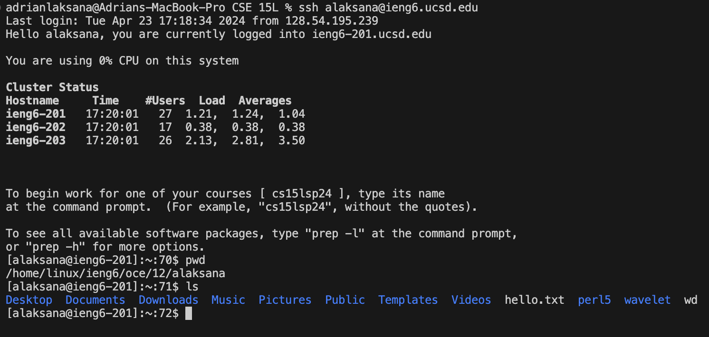  
Buttons Pressed:  
`ssh alaksana@ieng6.ucsd.edu + <enter>`  
In this step, I logged into the Ieng6 server using the command `ssh` followed by my username and the server name. This required no further input as I had already set up my SSH key and login.

## Step 5: Forking the Repo
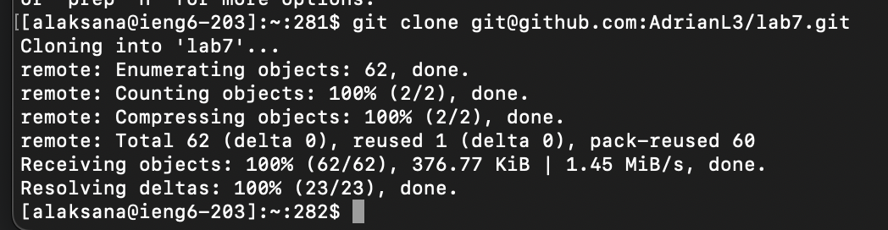  
Buttons Pressed:  
`git clone + <ctrl + v> + <enter>`  
In this step, I forked the repository by cloning the repository from the original repository to my local machine. This was done by copying the SSH link from the original repository and using the `git clone` command followed by the copied link. This created a local copy of the repository on my machine.

## Step 6: Running the Test
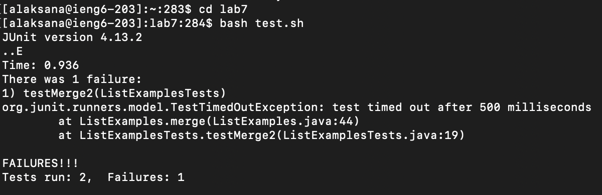  
Buttons Pressed:  
`cd lab7 + <enter>`
`bash test.sh + <enter>`  
In this step, I navigated to the lab7 directory and ran the test script using the command `bash test.sh`. This script runs the JUnit tests on the code in the lab7 directory. The tests failed, indicating that there were bugs in the code that needed to be fixed.

## Step 7: Fixing the Bugs
  
Buttons Pressed:  
`vim ArrayExamples.java + <enter>`  
This step opens `ArrayExamples.java` in the Vim text editor. This allows me to view and edit the code to fix the bugs that caused the JUnit tests to fail.

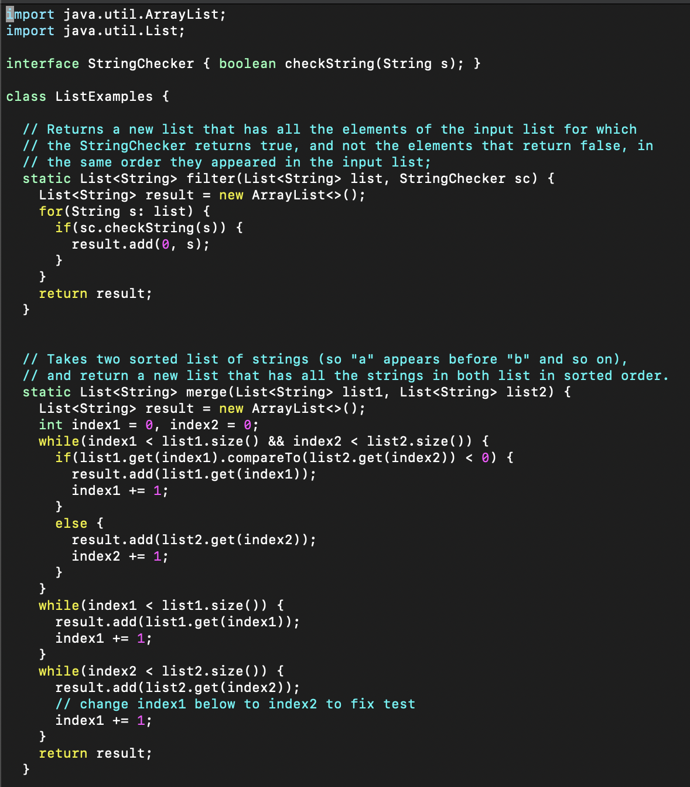  
This is the behavior of the file when opened in Vim. The cursor is placed at the beginning of the file.

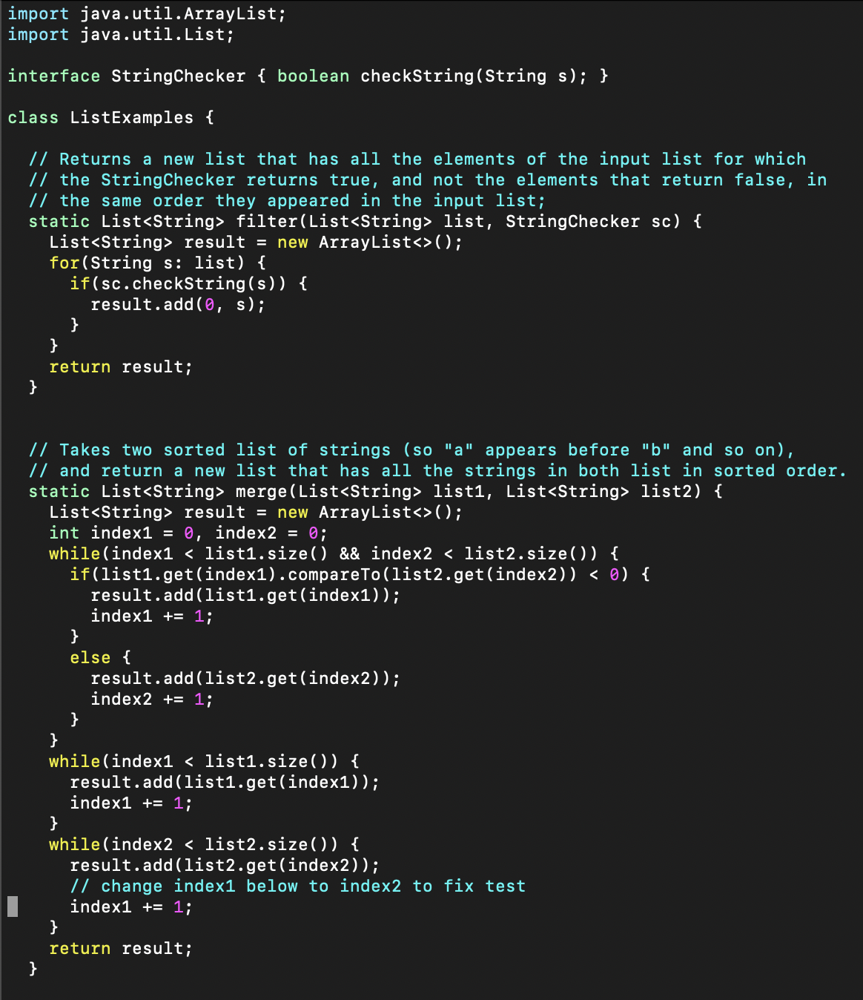  
Buttons Pressed:  
`43j`  
Since the bug was 43 lines from the top of the file, I used the command `43j` to move the cursor to the line where the bug was located.

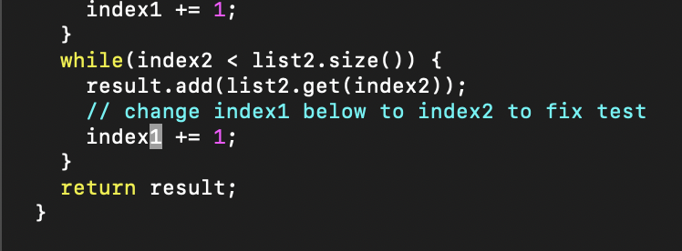  
Buttons Pressed:  
`e`    
I then used the `e` command to move the cursor to the end of the word where the bug was located.

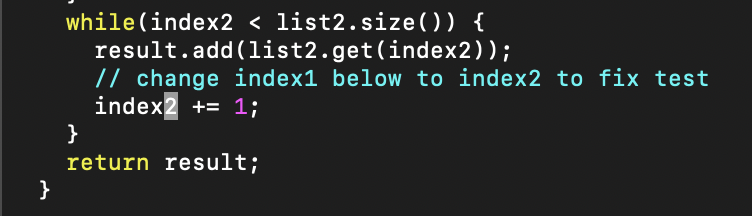  
Buttons Pressed:  
`r + 2`   
I replaced the incorrect number with the correct number by using the `r` command followed by the number `2`.

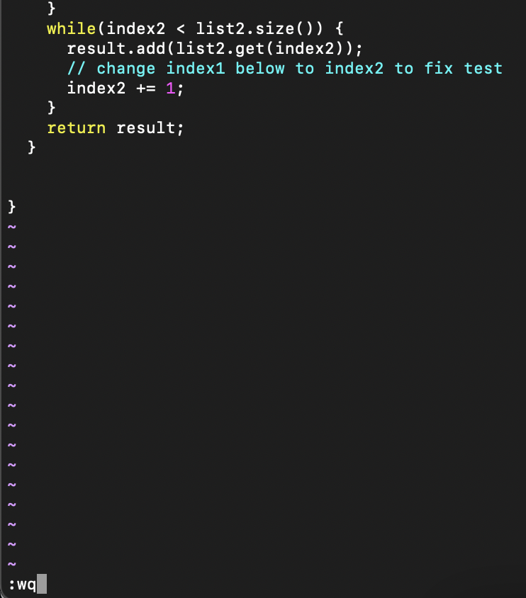  
Buttons Pressed:  
`:wq + <enter>`  
After fixing the bug, I saved and exited the file by using the command `:wq`.

## Step 8: Running the Test Again
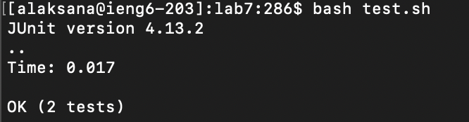  
Buttons Pressed:  
`bash test.sh + <enter>`  
After fixing the bug in the code, I ran the test script again using the command `bash test.sh`. This time, the JUnit tests passed, indicating that the bug had been successfully fixed.

## Step 9: Committing the Changes
  
Buttons Pressed:  
`git add . + <enter>`  
In this step, I added the changes made to the code to the staging area using the command `git add .`. the `.` indicates that all changes in the directory should be added to the staging area.

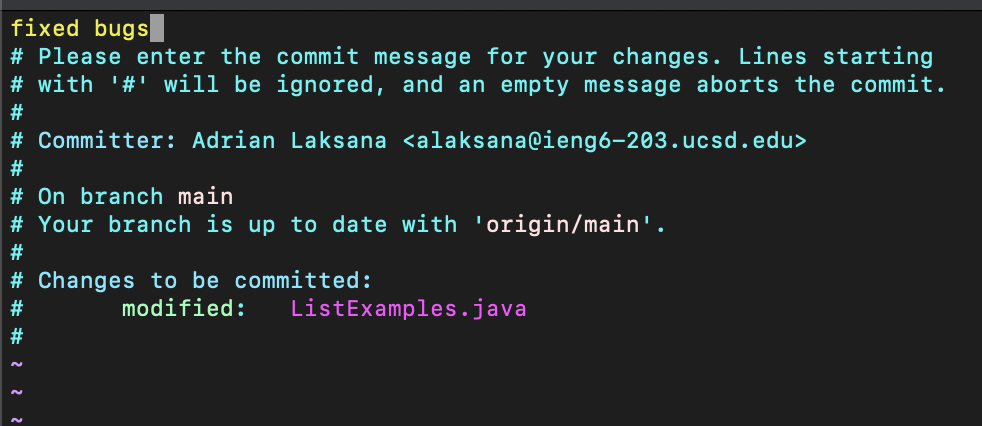  
Buttons Pressed:  
`git commit + <enter>`  
This step opens the Vim text editor to write a commit message. I entered a message describing the changes made to the code and saved and exited the file.

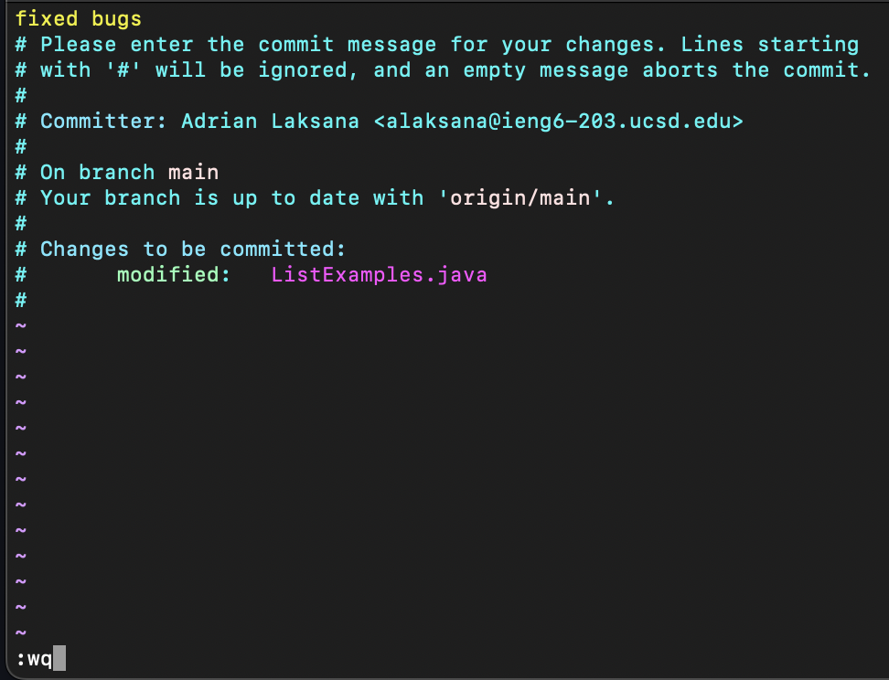  
`i + fixed bugs + <esc> + :wq + <enter>`  
I entered the commit message "fixed bugs" and saved and exited the file using the commands `:wq`.

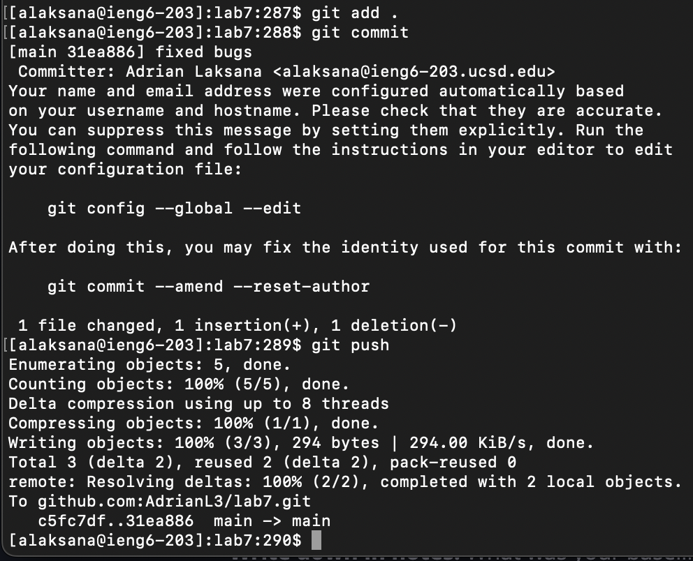  
Buttons Pressed:  
`git push + <enter>`  
After committing the changes, I pushed the changes to my forked repository using the command `git push`. This updated the repository on GitHub with the changes made to the code.