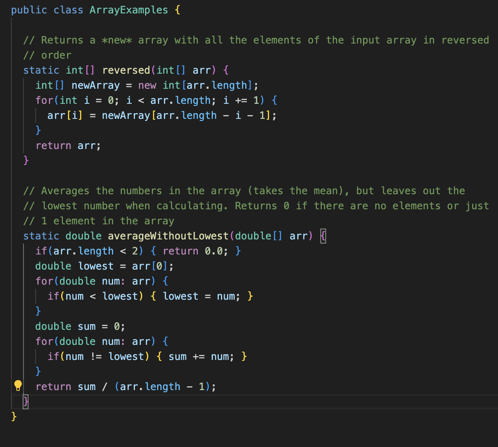
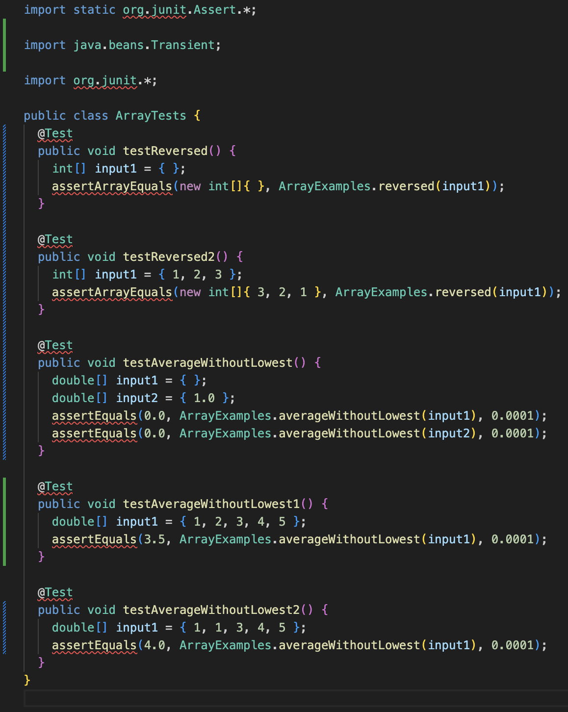
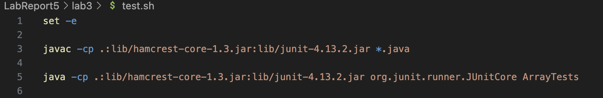
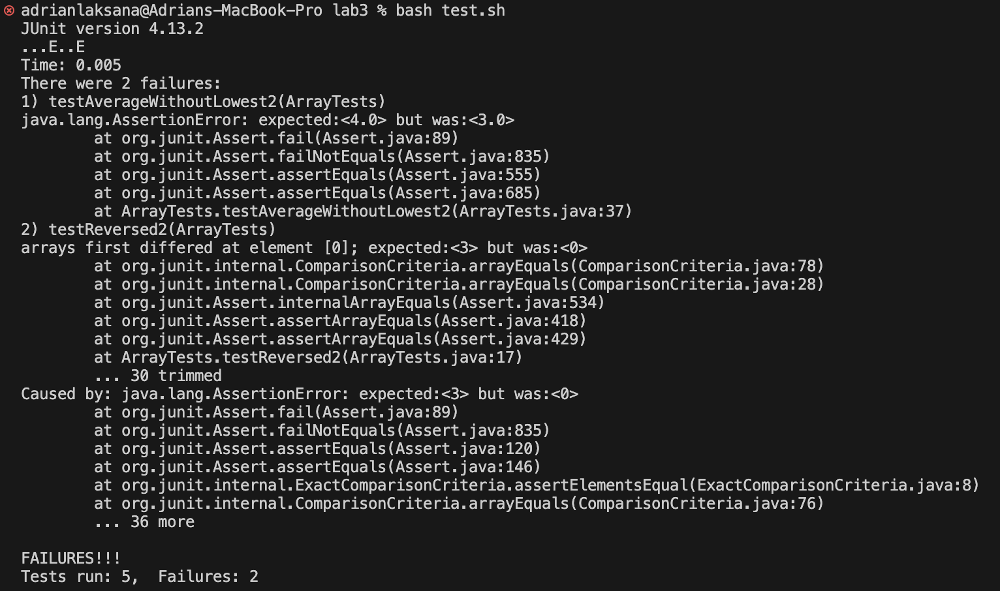
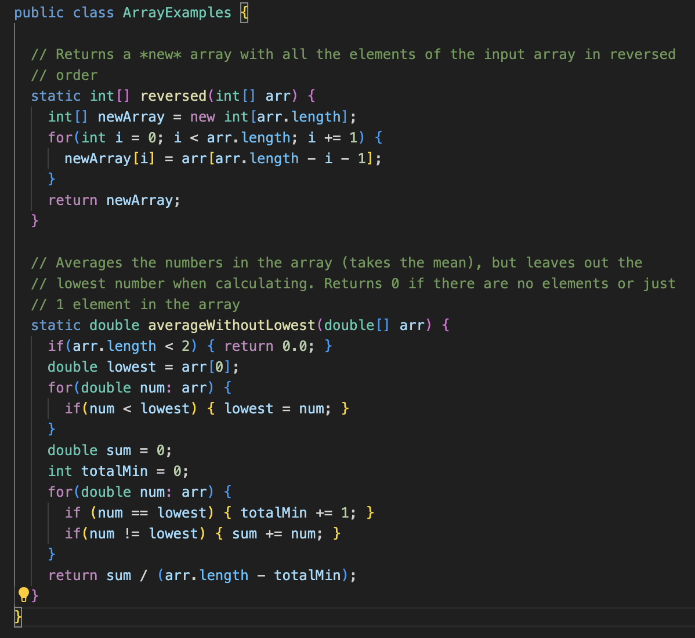
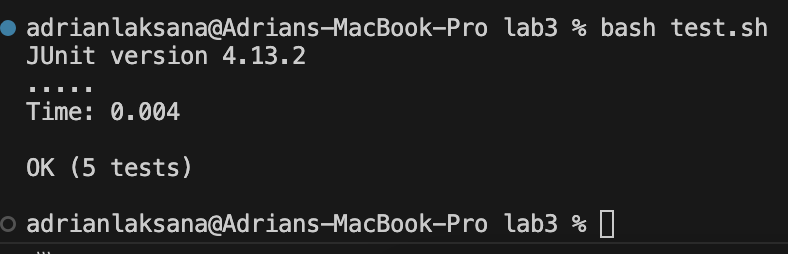

# **Lab Report 5**
***
## Part 1: Debugging Scenario

### Step 1: Orignal Post from Student
Student post:

I am trying to implement the reversed method and `avereagewithoutLowest` for the ArrayExamples class, but I am having trouble with the implementation. My code passes 3 out of the 5 tests, but I am not too sure what is wrong with my code. My guess for the `reversed` method could be that its reversing the array again after it has already been reversed. For the `averagewithoutLowest` I think the issue is when the lowest value is repeated multiple times in the array, it is not being removed from the array before calculating the average. Any help would be appreciated.  
Here is my code:  


Here is my Junits:  


Here is my bash script:  


Here is my output from running the JUnit tests:  



### Step 2: TA Response
TA response:

Hi, for the `reversed` method, while looking at the specifications of the method it says that the method should reverse the array and return a "new array". You are already making a `newArray` and it is not being rereversed. What array is being reversed? Right now, what do you have being returned? Additionally, for the `averagewithoutLowest` method, you have the right idea that when the lowest value is repeated multiple times in the array, it is causing a bug. If you look at your code, when you are calculating the sum, you are adding all the values that aren't the lowest and then dividing by the `length - 1`. What would the denominator be if the lowest value is repeated multiple times? Would it still be `length - 1`? How could you find a way to adjust the denominator to account for the repeated lowest value?  
Good luck!

### Step 3: Fixing the Bug
Debugged Code:  


New Output from JUnit tests:  


reversed method Bug:  
The bug of the method was that the orignal inputted array was being returned instead of the reversed array. Additionally, the newArray was intialized and not used to store the reversed array. Instead `arr` was being reassinged to the reversed index of `newArray` which is just an empty array.

averagewithoutLowest method Bug:  
The bug of the method was that the denominator was not being adjusted for the repeated lowest value. The denominator was always `length - 1` which would not be correct if the lowest value was repeated multiple times.

### Step 4: Information about Code
File Structure:  
```
adrianlaksana@Adrians-MacBook-Pro lab3 % tree
.
├── ArrayExamples.class
├── ArrayExamples.java
├── ArrayTests.class
├── ArrayTests.java
├── lib
│   ├── hamcrest-core-1.3.jar
│   └── junit-4.13.2.jar
└── test.sh

2 directories, 7 files
```

Content of files before fixes:  
  

  

  

Triggering the bug:
I triggered the bug by running the JUnit tests using the command `bash test.sh`. This ran the JUnit tests on the code in the `ArrayExamples.java` file. The tests that failed were `testReversed2` and `testAverageWithoutLowest2`. These tests failed because the `reversed` method was not returning the reversed array and the `averagewithoutLowest` method was not accounting for repeated lowest values.

#### Fixing the bugs:  
reversed method:  
To fix the bugs, I had to swap line 10 to `newArray[i] = arr[arr.length - i - 1];` and return `newArray` instead of the orignal array.

averagewithoutLowest method:  
To fix the bugs, I had to add a counter to count the number of times the lowest value was repeated and subtract that from the denominator. This was done by adding the line `if (arr[i] == lowest) {totalMin++;}` and changing the denominator to `length - totalMin`.

Content of files after fixes:  
  

  

## Part 2: Reflection
Something that helped me that I learned in the second half of this quarter is using VIM and jdb. Before this course, I primarily used IDEs to code and debug. However, by learning how to do everything in terminal it has expanded my knowledge of how to code and debug. While I will still be using IDEs in the future, having the possibility to do everything through the terminal is a useful skill that can be utilized to quickly access and edit files in limited conditions. 